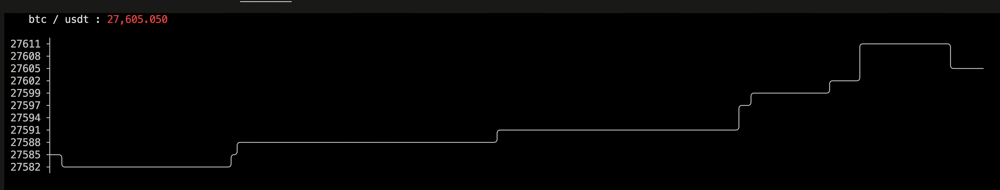

### go-crypto-howmuch
Made just for fun.
Can fetch crypto given by flags such as `symbol` and `symbolbase`.

Example:
```
Usage of ./bin/howmuchcrypto:
  -symbol string
        lower case crypto name (default "btc")
  -symbolbase string
        base, lower case crypto name (default "usdt")
```


